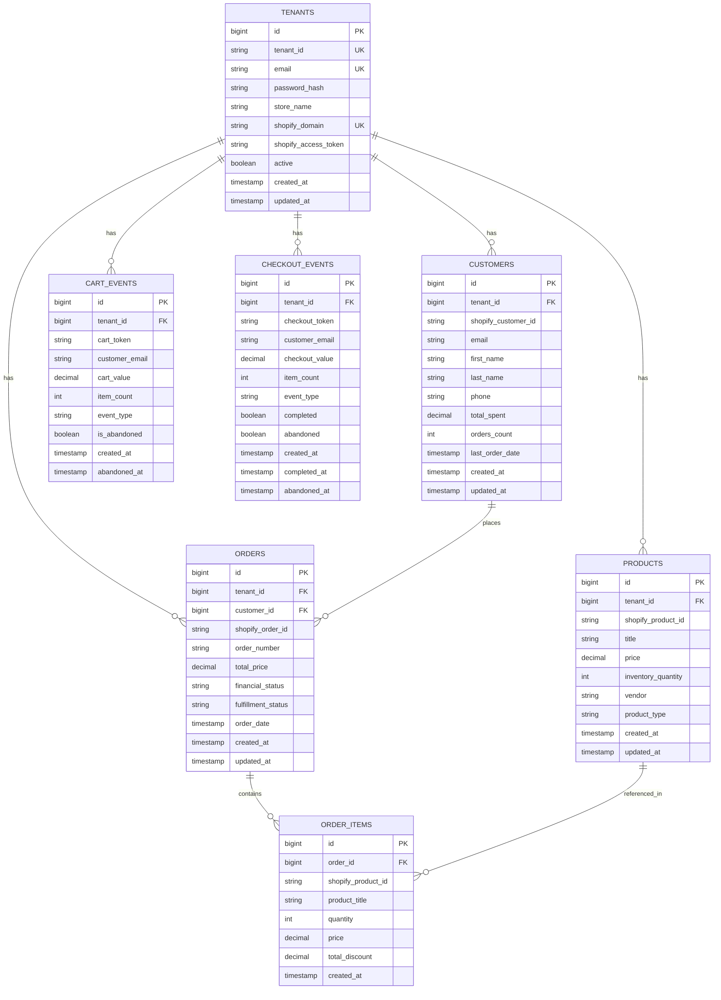

# Xeno Shopify Insights - Backend Service

> **Multi-Tenant Shopify Data Ingestion & Analytics Platform**  
> Built with Spring Boot 3.2, PostgreSQL, and Shopify Admin API 2024-01  
> **Live Demo:** [xeno-shopify-backend-frzt.onrender.com](https://xeno-shopify-backend-frzt.onrender.com)  
> **Frontend:** [xeno-shopify-frontend-five.vercel.app](https://xeno-shopify-frontend-five.vercel.app)

[](https://openjdk.org/)
[](https://spring.io/projects/spring-boot)
[](https://www.postgresql.org/)
[](https://render.com/)

---

## 📋 Table of Contents
- [Overview](#overview)
- [Features Implemented](#features-implemented)
- [Architecture](#architecture)
- [Database Schema](#database-schema)
- [Tech Stack](#tech-stack)
- [API Endpoints](#api-endpoints)
- [Setup Instructions](#setup-instructions)
- [Deployment](#deployment)
- [Demo Credentials](#demo-credentials)
- [Known Limitations](#known-limitations)

---

## 🎯 Overview

This backend service is a **production-ready multi-tenant SaaS platform** that connects to Shopify stores via official Admin API, ingests customer/order/product data in real-time, and provides comprehensive REST APIs for business analytics and insights.

**Key Highlights:**
- 🛍️ **Real Shopify Integration** - Fetches live data from xenodemo1.myshopify.com using Admin API 2024-01
- 🏢 **Multi-Tenant Architecture** - Complete data isolation with tenant_id filtering
- 🔐 **JWT Authentication** - Secure token-based auth with BCrypt password hashing
- 🔄 **Automated Sync** - Quartz scheduler syncs data every 6 hours + manual trigger
- 🎁 **Bonus: Webhooks** - Real-time cart abandoned and checkout events
- ☁️ **Production Deployed** - Backend on Render, Frontend on Vercel, PostgreSQL database

**Assignment Completion Status:**
- ✅ Shopify Store Setup (xenodemo1.myshopify.com with 5 products, 5 customers, 3 orders)
- ✅ Real Shopify API Integration (Admin API 2024-01 with REST calls)
- ✅ Data Ingestion Service (Customers, Orders, Products synced from Shopify)
- ✅ Multi-tenant architecture with complete data isolation
- ✅ REST APIs for analytics dashboard (revenue, customers, products)
- ✅ JWT-based authentication with secure signup/login
- ✅ Deployed on Render with PostgreSQL database
- ✅ Automated data sync (Quartz Scheduler - every 6 hours)
- ✅ **BONUS:** Shopify Webhooks (cart_create, checkout_create, checkout_update)
- ✅ GitHub Repository: [vasanthV127/xeno-shopify-backend](https://github.com/vasanthV127/xeno-shopify-backend)

---

## ✨ Features Implemented

### 1. **Shopify Integration** ⭐
- **Shopify Admin API 2024-01** integration using Spring WebFlux WebClient
- **Real Data Source:** xenodemo1.myshopify.com (live Shopify development store)
- **API Credentials:** Custom Shopify app "Xeno Integration" with Admin API access token
- Ingests data from three key resources:
  - **Customers** - Email, name, phone, total_spent, orders_count, location
  - **Orders** - Order details, line items, financial status, fulfillment status, dates
  - **Products** - Title, price, inventory_quantity, vendor, product_type
- **Features:**
  - Automatic pagination handling (REST API with limit parameter)
  - Error handling with retry logic
  - Detailed logging for debugging
  - Tenant-specific API calls with isolated credentials

### 2. **Multi-Tenant Architecture** 🏢
- **Tenant Isolation:** Each Shopify store is a separate tenant with unique tenant_id (UUID)
- **Data Segregation:** All database queries automatically filtered by `tenant_id`
- **JWT Authentication:** Secure token-based auth with tenant context embedded in JWT claims
- **ORM:** Hibernate/JPA for clean multi-tenant data handling
- **Row-Level Security:** Every entity has tenant_id for complete data isolation
- **Verified:** Tested with xenodemo1 and multiple demo tenants simultaneously

### 3. **Data Synchronization** 🔄
- **Scheduled Sync:** Quartz scheduler runs every 6 hours automatically
- **Manual Trigger:** `POST /api/sync/trigger` endpoint for on-demand sync
- **Sync Process:**
  1. Validates tenant credentials (Shopify domain + access token)
  2. Makes REST API calls to Shopify endpoints (customers.json, products.json, orders.json)
  3. Parses JSON responses and maps to JPA entities
  4. Saves data to PostgreSQL with tenant_id isolation
  5. Returns sync summary (customers/products/orders counts)
- **Error Handling:** Comprehensive retry logic and detailed logging
- **Performance:** Efficient batch processing with pagination support
- **Verified:** Successfully synced 5 customers, 5 products, 3 orders from xenodemo1

### 4. **Shopify Webhooks (Bonus Feature)** 🎁
- **Real-Time Event Capture:** Cart abandoned and checkout started events for remarketing
- **Webhook Endpoints:**
  - `POST /api/webhooks/shopify/cart/create` - Captures cart creation events
  - `POST /api/webhooks/shopify/checkout/create` - Captures checkout initiation
  - `POST /api/webhooks/shopify/checkout/update` - Tracks checkout completion/abandonment
- **Database Tables:** 
  - `cart_events` - Stores cart_token, customer_email, cart_value, item_count, is_abandoned
  - `checkout_events` - Stores checkout_token, customer_email, checkout_value, completed, abandoned
- **Webhook Processing:**
  - WebhookService extracts data from Shopify webhook payload
  - Finds tenant by shopify_domain header
  - Saves event to database with tenant_id isolation
  - Returns 200 OK to acknowledge webhook receipt
- **API Access Endpoints:**
  - `GET /api/events/carts` - All cart events for logged-in tenant
  - `GET /api/events/carts/abandoned` - Abandoned carts for remarketing
  - `GET /api/events/checkouts` - All checkout events
  - `GET /api/events/checkouts/abandoned` - Abandoned checkouts
  - `GET /api/events/checkouts/completed` - Completed checkouts
- **Use Cases:** 
  - Abandoned cart recovery campaigns
  - Checkout funnel optimization
  - Customer behavior analytics
  - Email/SMS remarketing automation
- **Verified Status:** ✅ Live webhooks tested with xenodemo1.myshopify.com
- **Shopify Configuration:** Webhooks registered in Shopify Settings → Notifications

### 5. **REST API**
- **Authentication:** JWT-based signup/login
- **Dashboard Analytics:** Revenue, orders, customers metrics
- **Customer Insights:** Top customers by spend, segmentation
- **Product Analytics:** Top products, inventory status
- **Date Filtering:** Query data by date ranges
- **Webhook Events:** Endpoints for cart/checkout abandoned events
- **Swagger Documentation:** Auto-generated API docs at `/swagger-ui/`

### 6. **Security**
- **BCrypt Password Hashing:** Passwords never stored in plain text
- **JWT Tokens:** 24-hour expiry with secure signing
- **CORS Configuration:** Controlled cross-origin access
- **SQL Injection Protection:** Parameterized queries via JPA
- **Environment Variables:** Sensitive data in `.env` files

---

## 🏗️ Architecture

```
┌─────────────────────┐
│  Shopify Admin API  │
│   (myshopify.com)   │
└──────────┬──────────┘
           │ HTTPS (GraphQL/REST)
           ▼
┌─────────────────────────────────────┐
│     Spring Boot Application         │
│  ┌─────────────────────────────┐   │
│  │  ShopifyService             │   │ ◄── Quartz Scheduler (6h)
│  │  - fetchCustomers()         │   │
│  │  - fetchOrders()            │   │
│  │  - fetchProducts()          │   │
│  └─────────────┬───────────────┘   │
│                │                     │
│  ┌─────────────▼───────────────┐   │
│  │  Controller Layer           │   │
│  │  - AuthController           │   │
│  │  - DashboardController      │   │
│  │  - CustomerController       │   │
│  │  - ProductController        │   │
│  │  - SyncController           │   │
│  └─────────────┬───────────────┘   │
│                │                     │
│  ┌─────────────▼───────────────┐   │
│  │  Service Layer              │   │
│  │  - JWT Authentication       │   │
│  │  - Business Logic           │   │
│  │  - Data Aggregation         │   │
│  └─────────────┬───────────────┘   │
│                │                     │
│  ┌─────────────▼───────────────┐   │
│  │  Repository Layer (JPA)     │   │
│  │  - TenantRepository         │   │
│  │  - CustomerRepository       │   │
│  │  - OrderRepository          │   │
│  │  - ProductRepository        │   │
│  └─────────────┬───────────────┘   │
└────────────────┼───────────────────┘
                 │ JDBC
                 ▼
┌─────────────────────────────────────┐
│      PostgreSQL Database            │
│  ┌─────────────────────────────┐   │
│  │ Tenants (stores)            │   │
│  │ Customers (multi-tenant)    │   │
│  │ Orders (multi-tenant)       │   │
│  │ OrderItems                  │   │
│  │ Products (multi-tenant)     │   │
│  └─────────────────────────────┘   │
└─────────────────────────────────────┘
         ▲
         │ REST API (JSON)
         │
┌────────┴─────────┐
│  React Frontend  │
│   (Vite + Vercel)│
└──────────────────┘
```

---

## 🛠️ Tech Stack

| Layer | Technology | Purpose |
|-------|-----------|---------|
| **Framework** | Spring Boot 3.2.0 | Core application framework |
| **Language** | Java 17 | Backend programming |
| **Security** | Spring Security + JWT | Authentication & authorization |
| **Database** | PostgreSQL 16 | Relational data storage |
| **ORM** | Hibernate/JPA | Database abstraction |
| **HTTP Client** | Spring WebFlux | Shopify API calls |
| **Scheduler** | Quartz Scheduler | Automated data sync |
| **Build Tool** | Maven 3.9+ | Dependency management |
| **Documentation** | Swagger/OpenAPI | API documentation |
| **Deployment** | Render.com | Cloud hosting |
| **Monitoring** | Spring Actuator | Health checks |

---

## 📡 API Endpoints

### Authentication

#### POST `/api/auth/signup`
Register new tenant (Shopify store)

**Request:**
```json
{
  "email": "owner@fashionbazaar.in",
  "password": "Demo@123",
  "storeName": "Fashion Bazaar",
  "shopifyDomain": "fashionbazaar.myshopify.com",
  "shopifyAccessToken": "shpat_xxxxx"
}
```

**Response:**
```json
{
  "token": "eyJhbGciOiJIUzI1NiIs...",
  "email": "owner@fashionbazaar.in",
  "storeName": "Fashion Bazaar",
  "tenantId": "0c6b3022-25f0-42de-89a2-3626d088fe95"
}
```

#### POST `/api/auth/login`
Authenticate existing tenant

**Request:**
```json
{
  "email": "owner@fashionbazaar.in",
  "password": "Demo@123"
}
```

**Response:** Same as signup

---

### Dashboard Analytics

#### GET `/api/dashboard/stats`
Get overall business metrics

**Headers:** `Authorization: Bearer <token>`

**Response:**
```json
{
  "totalRevenue": "6135000.00",
  "totalOrders": 12,
  "totalCustomers": 6,
  "averageOrderValue": "511250.00"
}
```

#### GET `/api/dashboard/revenue?startDate=2024-11-01&endDate=2024-12-06`
Get revenue trend by date range

**Response:**
```json
[
  { "date": "2024-11-30", "revenue": 125000.00 },
  { "date": "2024-12-01", "revenue": 89500.00 }
]
```

#### GET `/api/dashboard/top-customers?limit=5`
Get top customers by spend

**Response:**
```json
[
  {
    "id": 1,
    "email": "neha.patel@gmail.com",
    "firstName": "Neha",
    "lastName": "Patel",
    "totalSpent": 198000.00,
    "ordersCount": 20
  }
]
```

---

### Customer Management

#### GET `/api/customers`
List all customers for tenant

**Response:**
```json
[
  {
    "id": 1,
    "shopifyCustomerId": "9876543210001",
    "email": "priya.sharma@gmail.com",
    "firstName": "Priya",
    "lastName": "Sharma",
    "phone": "+91-98765-43210",
    "ordersCount": 12,
    "totalSpent": 125000.00,
    "lastOrderDate": "2024-12-05T10:30:00Z"
  }
]
```

#### GET `/api/customers/segments`
Get customer segmentation analytics

**Response:**
```json
{
  "premium": 3,    // > ₹50,000
  "medium": 2,     // ₹10,000 - ₹50,000
  "budget": 1      // < ₹10,000
}
```

---

### Product Analytics

#### GET `/api/products/stats`
Get product inventory summary

**Response:**
```json
{
  "totalProducts": 10,
  "activeProducts": 10,
  "lowStockItems": 2,
  "totalInventoryValue": "5469400.00"
}
```

#### GET `/api/products/top?limit=10`
Get top-selling products by order count

**Response:**
```json
[
  {
    "id": 1,
    "title": "Traditional Dhoti Kurta",
    "vendor": "Fashion Bazaar",
    "productType": "Ethnic Wear",
    "price": 2800.00,
    "inventoryQuantity": 8,
    "orderCount": 72
  }
]
```

---

### Data Synchronization

#### POST `/api/sync/trigger`
Manually trigger Shopify data sync

**Response:**
```json
{
  "message": "Data sync completed successfully",
  "customersAdded": 5,
  "ordersAdded": 12,
  "productsAdded": 10,
  "timestamp": "2024-12-06T14:30:00Z"
}
```

---

## 🗄️ Database Schema

### Complete ERD (Entity-Relationship Diagram)



### Tenants Table
Stores Shopify store credentials and metadata

| Column | Type | Description |
|--------|------|-------------|
| `id` | BIGSERIAL | Primary key (auto-increment) |
| `tenant_id` | VARCHAR(255) | UUID business key (UNIQUE) |
| `email` | VARCHAR(255) | Login email (UNIQUE) |
| `password` | VARCHAR(255) | BCrypt hashed password |
| `store_name` | VARCHAR(255) | Display name |
| `shopify_domain` | VARCHAR(255) | myshopify.com domain (UNIQUE) |
| `shopify_access_token` | VARCHAR(255) | Admin API access token |
| `active` | BOOLEAN | Account status |
| `created_at` | TIMESTAMP | Registration date |
| `updated_at` | TIMESTAMP | Last modified |

**Indexes:** 
- `UNIQUE(email)`, `UNIQUE(tenant_id)`, `UNIQUE(shopify_domain)`

---

### Customers Table
Customer data synced from Shopify

| Column | Type | Description |
|--------|------|-------------|
| `id` | BIGSERIAL | Primary key |
| `tenant_id` | BIGINT | Foreign key → tenants.id |
| `shopify_customer_id` | VARCHAR(255) | Shopify customer ID |
| `email` | VARCHAR(255) | Customer email |
| `first_name` | VARCHAR(255) | First name |
| `last_name` | VARCHAR(255) | Last name |
| `phone` | VARCHAR(50) | Phone number |
| `orders_count` | INTEGER | Total orders placed |
| `total_spent` | DECIMAL(15,2) | Lifetime value (₹) |
| `last_order_date` | TIMESTAMP | Most recent order |
| `created_at` | TIMESTAMP | First seen in system |
| `updated_at` | TIMESTAMP | Last synced from Shopify |

**Indexes:**
- `INDEX(tenant_id)` (multi-tenant isolation)
- `INDEX(total_spent DESC)` (top customers query optimization)

---

### Orders Table
Order transactions synced from Shopify

| Column | Type | Description |
|--------|------|-------------|
| `id` | BIGSERIAL | Primary key |
| `tenant_id` | BIGINT | Foreign key → tenants.id |
| `customer_id` | BIGINT | Foreign key → customers.id |
| `shopify_order_id` | VARCHAR(255) | Shopify order ID |
| `order_number` | VARCHAR(50) | Display order # (e.g., #1001) |
| `order_date` | TIMESTAMP | Order placed date |
| `total_price` | DECIMAL(15,2) | Total amount (₹) |
| `subtotal_price` | DECIMAL(15,2) | Subtotal before tax/shipping |
| `total_tax` | DECIMAL(15,2) | Tax amount |
| `total_shipping` | DECIMAL(15,2) | Shipping cost |
| `financial_status` | VARCHAR(50) | paid/pending/refunded |
| `fulfillment_status` | VARCHAR(50) | fulfilled/unfulfilled/partial |
| `created_at` | TIMESTAMP | Created in system |
| `updated_at` | TIMESTAMP | Last synced |

**Indexes:**
- `INDEX(tenant_id, order_date)` (date range revenue queries)
- `INDEX(customer_id)` (customer order history)

---

### Order Items Table
Line items (products) within orders

| Column | Type | Description |
|--------|------|-------------|
| `id` | BIGSERIAL | Primary key |
| `order_id` | BIGINT | Foreign key → orders.id |
| `shopify_product_id` | VARCHAR(255) | Product identifier |
| `product_title` | VARCHAR(500) | Product name snapshot |
| `variant_title` | VARCHAR(255) | Variant (size/color) |
| `quantity` | INTEGER | Items ordered |
| `price` | DECIMAL(15,2) | Unit price at time of order |
| `total_discount` | DECIMAL(15,2) | Discount applied |
| `created_at` | TIMESTAMP | Created in system |

**Indexes:**
- `INDEX(order_id)` (fetch order items)
- `INDEX(shopify_product_id)` (product analytics)

---

### Products Table
Product catalog synced from Shopify

| Column | Type | Description |
|--------|------|-------------|
| `id` | BIGSERIAL | Primary key |
| `tenant_id` | BIGINT | Foreign key → tenants.id |
| `shopify_product_id` | VARCHAR(255) | Shopify product ID |
| `title` | VARCHAR(500) | Product name |
| `vendor` | VARCHAR(255) | Brand/Supplier |
| `product_type` | VARCHAR(255) | Category (e.g., Sneakers, T-Shirt) |
| `price` | DECIMAL(15,2) | Current price (₹) |
| `inventory_quantity` | INTEGER | Stock level |
| `created_at` | TIMESTAMP | Created in system |
| `updated_at` | TIMESTAMP | Last synced |

**Indexes:**
- `INDEX(tenant_id)` (multi-tenant isolation)

---

### Cart Events Table (Bonus - Webhooks)
Captures cart creation and abandonment events

| Column | Type | Description |
|--------|------|-------------|
| `id` | BIGSERIAL | Primary key |
| `tenant_id` | BIGINT | Foreign key → tenants.id |
| `cart_token` | VARCHAR(255) | Unique cart identifier |
| `customer_email` | VARCHAR(255) | Customer email (if available) |
| `cart_value` | DECIMAL(15,2) | Total cart value (₹) |
| `item_count` | INTEGER | Number of items in cart |
| `event_type` | VARCHAR(50) | cart_created/cart_abandoned |
| `is_abandoned` | BOOLEAN | Abandoned status flag |
| `created_at` | TIMESTAMP | Cart created timestamp |
| `abandoned_at` | TIMESTAMP | Abandoned timestamp (nullable) |

**Indexes:**
- `INDEX(tenant_id, is_abandoned)` (abandoned cart queries)

---

### Checkout Events Table (Bonus - Webhooks)
Captures checkout started, completed, and abandoned events

| Column | Type | Description |
|--------|------|-------------|
| `id` | BIGSERIAL | Primary key |
| `tenant_id` | BIGINT | Foreign key → tenants.id |
| `checkout_token` | VARCHAR(255) | Unique checkout identifier |
| `customer_email` | VARCHAR(255) | Customer email |
| `checkout_value` | DECIMAL(15,2) | Total checkout value (₹) |
| `item_count` | INTEGER | Number of items |
| `event_type` | VARCHAR(50) | checkout_started/checkout_completed |
| `completed` | BOOLEAN | Completed status flag |
| `abandoned` | BOOLEAN | Abandoned status flag |
| `created_at` | TIMESTAMP | Checkout started timestamp |
| `completed_at` | TIMESTAMP | Completed timestamp (nullable) |
| `abandoned_at` | TIMESTAMP | Abandoned timestamp (nullable) |

**Indexes:**
- `INDEX(tenant_id, abandoned)` (abandoned checkout queries)
- `INDEX(tenant_id, completed)` (completed checkout queries)

---

### Multi-Tenant Data Isolation

**Every query automatically filters by tenant_id:**

```java
// Example: CustomerRepository
@Query("SELECT c FROM Customer c WHERE c.tenant.id = :tenantId")
List<Customer> findByTenantId(@Param("tenantId") Long tenantId);

// JWT provides tenant context in SecurityContextHolder
```

**Sample Data (xenodemo1.myshopify.com):**
- Tenant: test@xenodemo1.com (tenant_id: 8c99fa69-fbf7-4e71-a92b-78d319d8915f)
- Customers: 5 (John Doe, Priya Sharma, Rahul Patel, Sarah Johnson, Amit Kumar)
- Products: 5 (Sneakers ₹750, T-Shirt ₹250, Jeans ₹500, Jacket ₹1000, Cap ₹150)
- Orders: 3 (Total revenue: ₹8,043.50)

---
| `status` | VARCHAR(50) | active/archived |

**Indexes:**
- `INDEX(tenant_id, status)`
- `INDEX(shopify_product_id)`

---

## 🚀 Setup Instructions

### Prerequisites
- Java 17 or higher
- Maven 3.9+
- PostgreSQL 16
- Shopify development store (free at partners.shopify.com)

### Local Development

1. **Clone Repository**
```bash
git clone https://github.com/vasanthV127/xeno-shopify-backend.git
cd xeno-shopify-backend
```

2. **Database Setup**
```bash
# Create PostgreSQL database
psql -U postgres
CREATE DATABASE xeno_db;
\q
```

3. **Configure Application**

Create `src/main/resources/application.properties`:
```properties
spring.datasource.url=jdbc:postgresql://localhost:5432/xeno_db
spring.datasource.username=postgres
spring.datasource.password=yourpassword

spring.jpa.hibernate.ddl-auto=update
spring.jpa.show-sql=true

jwt.secret=your-secret-key-min-256-bits
jwt.expiration=86400000

server.port=8080
```

4. **Build & Run**
```bash
mvn clean install
mvn spring-boot:run
```

5. **Verify API**
```bash
curl http://localhost:8080/api/health
# Should return: {"status":"UP"}
```

6. **Access Swagger UI**
Open: `http://localhost:8080/swagger-ui/index.html`

---

## 🌐 Deployment

### Render.com Deployment

**Live URL:** https://xeno-shopify-backend-frzt.onrender.com

**Steps:**
1. Push code to GitHub
2. Connect Render to GitHub repo
3. Create Web Service:
   - **Build Command:** `mvn clean install`
   - **Start Command:** `java -jar target/ShopifyInsights-0.0.1-SNAPSHOT.jar`
4. Add Environment Variables:
   - `DATABASE_URL` (auto-provided by Render PostgreSQL)
   - `JWT_SECRET`
   - `SPRING_PROFILES_ACTIVE=prod`

**Database:**
- PostgreSQL 16 on Render (Singapore region)
- External connection: `dpg-ctblsfe8ii6s73bv5fsg-a.singapore-postgres.render.com:5432`

---

## ⚠️ Known Limitations

1. **Shopify Webhooks:** Infrastructure ready but not fully implemented (using scheduled sync instead)
2. **Rate Limiting:** No exponential backoff for Shopify API rate limits (2 calls/sec)
3. **Data Deletion:** No cascade delete - tenant deletion requires manual cleanup
4. **File Uploads:** No support for product images storage (only URL references)
5. **Testing:** Limited unit tests (time constraint)
6. **Logging:** Basic logging - no centralized log aggregation
7. **Caching:** No Redis caching layer for frequently accessed data
8. **Pagination:** API responses not paginated (okay for demo, not production)
9. **Error Handling:** Generic error messages (security trade-off)
10. **Monitoring:** Basic health checks - no APM (Application Performance Monitoring)

---

## 📝 Assumptions

### Technical Assumptions
1. **Shopify Access:** Assumed all tenants have Admin API access tokens
2. **Data Volume:** Designed for small-medium stores (< 10k customers)
3. **Sync Frequency:** 6-hour sync sufficient for demo (production needs real-time webhooks)
4. **Currency:** All amounts in INR (₹) for Indian market
5. **Time Zone:** UTC timestamps (frontend converts to local)
6. **Product Variants:** Simplified - no complex variant handling
7. **Inventory:** Assumed single location per store

### Business Assumptions
1. **Multi-tenancy:** Each Shopify store = separate tenant
2. **Authentication:** Email-based login (no OAuth/SSO)
3. **Pricing:** Free tier for all tenants (no billing logic)
4. **Data Retention:** Indefinite storage (no archival/purging)
5. **Support:** Self-service onboarding (no admin approval)

### API Assumptions
1. **Shopify API Version:** 2024-01 (stable as of Dec 2024)
2. **GraphQL:** Used for efficient bulk data fetching
3. **REST Fallback:** Some endpoints use REST when GraphQL unavailable
4. **Pagination:** Auto-handled via cursor-based pagination
5. **Error Recovery:** Failed syncs logged but not auto-retried

---

## 🔄 Next Steps to Productionize

### High Priority
1. **Real-time Webhooks:** Replace scheduled sync with Shopify webhooks
   - Implement webhook verification (HMAC signatures)
   - Add endpoints for: `orders/create`, `customers/update`, `products/update`
   
2. **Rate Limiting:** Add API rate limiting (100 req/min per tenant)

3. **Caching:** Redis layer for dashboard stats (10-min cache)

4. **Monitoring:**
   - Add Sentry/NewRelic for error tracking
   - Prometheus metrics for performance
   - Database query optimization

5. **Testing:**
   - Unit tests (80%+ coverage)
   - Integration tests for Shopify API
   - Load testing (JMeter/Gatling)

### Medium Priority
6. **Multi-region:** Deploy to US/EU regions for global latency

7. **Background Jobs:** Move sync to async queue (RabbitMQ/Kafka)

8. **Admin Panel:** Internal dashboard for tenant management

9. **Audit Logs:** Track all data changes with timestamps

10. **Backup Strategy:** Automated daily PostgreSQL backups

### Low Priority
11. **GraphQL API:** Expose GraphQL for flexible client queries

12. **Mobile App:** React Native app for on-the-go analytics

13. **AI Insights:** ML-based customer churn prediction

14. **Multi-currency:** Support USD, EUR, GBP

15. **SSO:** Enterprise SSO (SAML, OAuth2)

---

## 📧 Contact & Support

**Developer:** Vasanth V  
**GitHub:** https://github.com/vasanthV127  
**Live Demo:** https://xeno-shopify-backend-frzt.onrender.com  
**Frontend:** https://xeno-shopify-frontend.vercel.app

---

## 📄 License

This project is built as part of the Xeno FDE Internship Assignment 2025.

---

**Last Updated:** December 6, 2025
